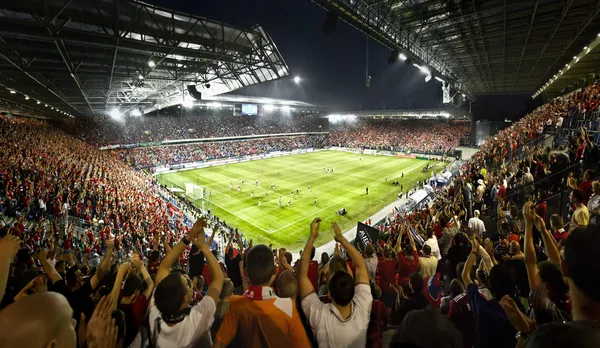
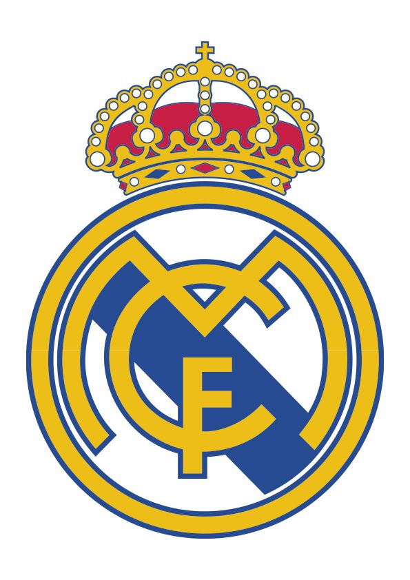

# ⚽ Redonda FC

**Redonda FC** es un portal web deportivo multipágina orientado al fútbol.  
Presenta noticias, estadísticas, partidos, equipos y jugadores destacados, con una interfaz moderna, responsiva y fácil de navegar.



---

## 📂 Estructura del proyecto

```
Redonda-fc-main/
├── index.html                # Página principal (home)
├── pages/                    # Subpáginas internas
│   ├── equipos.html          # Listado de equipos + comparador
│   ├── estadisticas.html     # Tablas de goleadores, asistencias y porteros
│   ├── noticias.html         # Noticias filtrables y buscador
│   └── partidos.html         # Calendario de partidos y en vivo
├── css/
│   └── estilos.css           # Estilos compilados desde SCSS
├── scss/                     # Código fuente SCSS modular
│   ├── base/                 # Estilos globales, variables y utilidades
│   └── components/           # Header, main y footer
├── img/                      # Imágenes (logo, banners, jugadores, noticias, etc.)
├── wireframe/                # Prototipo visual en PDF
│   └── wireframe.pdf
├── package.json              # Configuración mínima (sin dependencias)
└── README.md                 # Este archivo
```

---

## 🛠️ Tecnologías utilizadas

- **HTML5 semántico**  
- **CSS3 / SCSS modular** (compilado a un único `estilos.css`)  
- **Bootstrap 5.3** (grillas, navbar, utilidades)  
- **Bootstrap Icons**  
- **Google Fonts (Roboto)**  
- **JSON (estructura prevista para datos)**  
- **Metodología multipágina estática**

---

## ✨ Características principales

- ✅ Sitio multipágina: Inicio, Noticias, Equipos, Partidos y Estadísticas.  
- ✅ Navbar responsivo con Bootstrap y branding.  
- ✅ Hero banner con imagen destacada y overlay.  
- ✅ Cards reutilizables para noticias, partidos, equipos y jugadores.  
- ✅ Filtros visuales para noticias, equipos y estadísticas.  
- ✅ Comparador de equipos (estructura de UI lista).  
- ✅ Diseño **responsive** con breakpoints a 768px y 576px.  
- ✅ Paleta de colores y tipografía definidas mediante **CSS custom properties**.  
- ✅ Wireframe incluido para referencia de diseño.  

---

## 📸 Capturas

### Inicio


### Noticias


### Equipos


---

## 🚀 Instalación y uso

1. Clonar el repositorio o descargar el ZIP:  
   ```bash
   git clone https://github.com/usuario/redonda-fc.git
   ```

2. Abrir el archivo `index.html` en cualquier navegador moderno.  
   > No se requieren dependencias ni servidor adicional.

3. *(Opcional)* Si deseas recompilar los estilos SCSS:  
   ```bash
   npm install -g sass
   sass scss/estilos.scss css/estilos.css --watch
   ```

---

## 📌 Pendiente / TODO

- [ ] Implementar `js/script.js` para:
  - Activar tabs de estadísticas y partidos.
  - Filtros dinámicos en noticias y equipos.
  - Buscador funcional.  
- [ ] Optimizar imágenes (logo y banner son pesados).  
- [ ] Mejorar SEO (OpenGraph, Twitter Cards, canonical).  
- [ ] Agregar `loading="lazy"` en imágenes.  

---

## 📄 Licencia

Este proyecto se distribuye bajo la licencia MIT.  
Eres libre de usarlo, modificarlo y adaptarlo para tus proyectos.  

---

## 👨‍💻 Autor

Proyecto desarrollado por **[Tu Nombre]** como plantilla web deportiva.  
